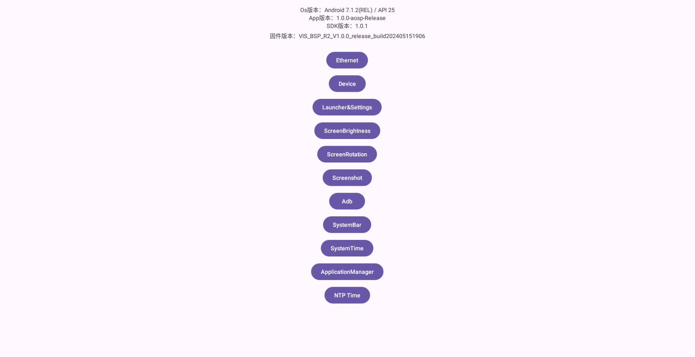

# AndroidSystemPermission

[](./LICENSE.txt) [](https://central.sonatype.com/artifact/com.sunxiaodou.android/system-permission-api)

本项目是Android系统权限工具集，需依赖系统签名并配置 `android:sharedUserId="android.uid.system"`。

> API兼容性：Android 5.1(21) - Android 16(36)
>
> 目前仅在瑞芯微系列板卡上进行了测试，相应的厂商如下：
>
> - AOSP
> - 海康威视
> - 欣威视通
> - 迪文

## 特性

| 接口名称                              | 接口描述                           | Android API | 支持版本       | 备注 |
| ------------------------------------- | ---------------------------------- | ----------- | -------------- | ---- |
| `setContext`                          | 设置上下文                         |             | 1.0.0 - latest |      |
| `getVendor`                           | 获取厂商标识                       |             | 1.0.0 - latest |      |
| `getVersion`                          | 获取SDK版本                        |             | 1.0.0 - latest |      |
| `enableEthernet`                      | 是否启用以太网                     |             | 1.0.0 - latest |      |
| `isEthernetEnabled`                   | 以太网是否启用                     |             | 1.0.0 - latest |      |
| `setEthernetStaticAddress`            | 设置以太网静态地址                 |             | 1.0.0 - latest |      |
| `setEthernetDhcpAddress`              | 设置以太网DHCP                     |             | 1.0.0 - latest |      |
| `getEthernetNetworkAddress`           | 获取以太网网络地址                 |             | 1.0.0 - latest |      |
| `getEthernetMacAddress`               | 获取以太网MAC地址                  |             | 1.0.0 - latest |      |
| `reboot`                              | 重启设备                           |             | 1.0.0 - latest |      |
| `shutdown`                            | 关闭设备                           |             | 1.0.0 - latest |      |
| `factoryReset`                        | 恢复出厂设置                       |             | 1.0.1 - latest |      |
| `grantRuntimePermission`              | 静默授予运行时权限和特殊权限       |             | 1.0.0 - latest |      |
| `grantUsbPermission`                  | 静默授予Usb权限                    |             | 1.0.1 - latest |      |
| `getLauncher`                         | 获取系统桌面                       |             | 1.0.0 - latest |      |
| `setLauncher`                         | 设置系统桌面                       |             | 1.0.0 - latest |      |
| `openSystemLauncher`                  | 打开系统桌面                       |             | 1.0.0 - latest |      |
| `openSystemSettings`                  | 打开系统设置                       |             | 1.0.0 - latest |      |
| `openSystemDevelopmentSettings`       | 打开系统开发者选项设置             |             | 1.0.0 - latest |      |
| `setScreenBrightness`                 | 设置屏幕百分比亮度                 |             | 1.0.0 - latest |      |
| `getScreenBrightness`                 | 获取屏幕百分比亮度                 |             | 1.0.0 - latest |      |
| `enableAutoBrightness`                | 是否启用自动调节亮度               |             | 1.0.0 - latest |      |
| `isAutoBrightnessEnabled`             | 自动调节亮度是否启用               |             | 1.0.0 - latest |      |
| `enableDarkUI`                        | 是否启用深色主题                   | API 30      | 1.0.0 - latest |      |
| `isDarkUIEnabled`                     | 深色主题是否启用                   | API 30      | 1.0.0 - latest |      |
| `enableScreenNeverOff`                | 是否启用永不关闭屏幕               |             | 1.0.0 - latest |      |
| `isScreenNeverOffEnabled`             | 永不关闭屏幕是否启用               |             | 1.0.0 - latest |      |
| `setScreenOn`                         | 亮屏                               |             | 1.0.0 - latest |      |
| `setScreenOff`                        | 息屏                               |             | 1.0.0 - latest |      |
| `enableScreenAutoRotation`            | 是否启用屏幕自动旋转               |             | 1.0.0 - latest |      |
| `isScreenAutoRotationEnabled`         | 屏幕自动旋转是否启用               |             | 1.0.0 - latest |      |
| `setScreenRotation`                   | 设置屏幕旋转，顺时针旋转           |             | 1.0.0 - latest |      |
| `getScreenRotation`                   | 获取屏幕旋转                       |             | 1.0.0 - latest |      |
| `enableAdb`                           | 是否启用ADB                        |             | 1.0.0 - latest |      |
| `isAdbEnabled`                        | ADB是否启用                        |             | 1.0.0 - latest |      |
| `setAdbPort`                          | 设置ADB端口                        |             | 1.0.0 - latest |      |
| `getAdbPort`                          | 获取ADB端口                        |             | 1.0.0 - latest |      |
| `enableSystemBar`                     | 是否启用状态栏和导航栏             |             | 1.0.0 - latest |      |
| `isSystemBarEnabled`                  | 状态栏和导航栏是否启用             |             | 1.0.0 - latest |      |
| `setTimeZone`                         | 设置系统时区                       |             | 1.0.0 - latest |      |
| `setDate`                             | 设置系统日期                       |             | 1.0.0 - latest |      |
| `setTime`                             | 设置系统时间                       |             | 1.0.0 - latest |      |
| `enableTimeFormat24H`                 | 是否启用24小时制                   |             | 1.0.0 - latest |      |
| `isTimeFormat24HEnabled`              | 24小时制是否启用                   |             | 1.0.0 - latest |      |
| `clearApplicationUserData`            | 清除应用程序用户数据，包含缓存数据 |             | 1.0.0 - latest |      |
| `installPackage`                      | 静默安装                           |             | 1.0.0 - latest |      |
| `uninstallPackage`                    | 静默卸载                           |             | 1.0.0 - latest |      |
| `killBackgroundProcesses`             | 杀死应用后台进程                   |             | 1.0.0 - latest |      |
| `forceStopPackage`                    | 强行停止应用                       |             | 1.0.0 - latest |      |
| `installOTAPackage`                   | OTA升级                            |             | 1.0.0 - latest |      |
| `takeScreenShot`                      | 屏幕截图                           |             | 1.0.0 - latest |      |
| `takeScreenShot`                      | 屏幕截图                           |             | 1.0.0 - latest |      |
| `getFirmwareVersion`                  | 获取固件版本                       |             | 1.0.0 - latest |      |
| `getNtpTime`                          | 获取NTP服务器时间                  |             | 1.0.0 - latest |      |
| `addToPermanentPowerSaveAllowList`    | 忽略应用电池优化                   | API 23      | 1.0.0 - latest |      |
| `removeToPermanentPowerSaveAllowList` | 应用电池优化                       | API 23      | 1.0.0 - latest |      |
| `isPowerSaveWhitelistApp`             | 应用是否已忽略电池优化             | API 23      | 1.0.0 - latest |      |
| `currentPackageName`                  | 获取当前包名                       |             | 1.0.0 - latest |      |
| `currentProcessName`                  | 获取当前进程名                     |             | 1.0.0 - latest |      |
| `currentApplication`                  | 获取当前 `Application`             |             | 1.0.0 - latest |      |

## 集成

```kotlin
// AOSP
implemention("com.sunxiaodou.android:system-permission-adapter-aosp:${latest-version}")

// 海康威视
implemention("com.sunxiaodou.android:system-permission-adapter-hikvision:${latest-version}")

// 欣威视通
implemention("com.sunxiaodou.android:system-permission-adapter-signway:${latest-version}")

// 迪文
implemention("com.sunxiaodou.android:system-permission-adapter-dwin:${latest-version}")
```

## 使用

首先在 Application 里初始化：

```kotlin
class PermissionApplication : Application() {

    companion object {
        private const val TAG = "PermissionApplication"
    }

    override fun onCreate() {
        super.onCreate()

        Log.d(TAG, "onCreate: currentProcessName: ${SystemPermissionCompat.currentProcessName()}")

        // 1.首先必须根据厂商选择合适的实现，进行注入
        SystemPermissionCompat.setDelegate(AospSystemPermission())			// AOSP
        // SystemPermissionCompat.setDelegate(HikvisionSystemPermission()) 	// 海康威视
        // SystemPermissionCompat.setDelegate(SignWaySystemPermission())	// 欣威视通
        // SystemPermissionCompat.setDelegate(DWinSystemPermission()) 		// 迪文
        
        // 2.然后注入Context进行初始化
        SystemPermissionCompat.setContext(this)
    }
}
```

## 示例

### 获取以太网地址

```kotlin
val address = SystemPermissionCompat.getEthernetNetworkAddress()
```

### 重启设备

```kotlin
val reboot = SystemPermissionCompat.reboot()
```


